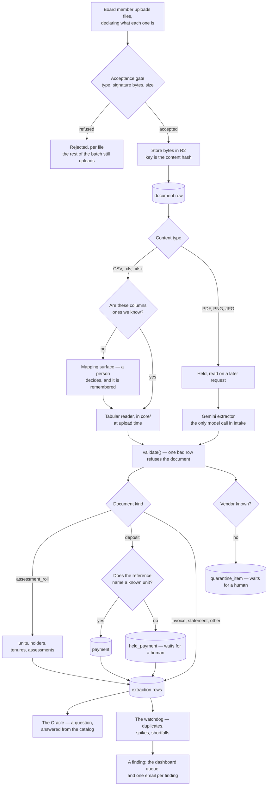

<p align="center">
  
</p>

# HOA Watchdog

An AI condominium treasury assistant. A board uploads the association's invoices, bank statements
and assessment rolls; the system reads them into structured records, refuses to guess when a
document is ambiguous, answers questions with the underlying records on screen, and flags probable
duplicate invoices, unusual vendor billing and missed dues before the board pays.

Planning artifacts live in [`_bmad-output/planning-artifacts/`](_bmad-output/planning-artifacts/);
the product requirements are in [`docs/prd/prd.md`](docs/prd/prd.md). What the code actually does,
checked against the source rather than against the intent, is in
[`docs/as-built.md`](docs/as-built.md).

## Where this stands

Six epics were planned. Four are complete, the fifth has landed every story, and the sixth has not
started.

| Epic | What it is | Status |
| --- | --- | --- |
| 1 | Sign in, upload, read a document, hold what cannot be resolved | Done |
| 2 | Units, holders, assessments, and deposits becoming payments | Done |
| 3 | The Oracle — a versioned query catalog, a reasoning service, a numeric validator, an ask surface | Done |
| 4 | The watchdog — duplicate invoices, vendor spikes, dues shortfalls, and the alert email | Done |
| 5 | Onboarding — a document declares its kind, its columns are mapped and remembered, directors are provisioned in the product | Stories done; retrospective outstanding |
| 6 | Connected document sources | Backlog |

One caveat worth reading before the feature list below: **this product has been exercised by its
tests and by its authors, not by a board.** Every claim of correctness here is a claim about a suite.

## Prerequisites

- **Node.js 24 or newer.**
- **A PostgreSQL 18 database.** Two connection strings are needed, one writing and one read-only —
  see [Environment](#environment).
- **An S3-compatible bucket** (Cloudflare R2 in the pilot) for the uploaded bytes.
- **A Google Gemini API key**, used only to read scans and photographs. Spreadsheets never reach it.
- **Python 3.13**, for the agent service — 3.13 specifically, because CrewAI refuses 3.14. Needed
  only to answer questions; upload and detection never touch it.

## Getting started

Five steps, and none of them can be skipped. A clone that stops after `npm run dev` has an
application whose every upload fails on a missing table.

```bash
npm install
cp .env.example .env.local     # then fill it in — see Environment
npm run migrate                # create the schema; without this nothing can be stored
node scripts/add-board-member.mjs board@example.org
npm run dev
```

`add-board-member.mjs` creates the **first** director of an association, and resets a password for
somebody locked out. Every director after the first is added inside the product, at `/directors` —
that surface derives the association from whoever is doing the adding, which is what makes it safe
and is exactly why it cannot serve the first one: nobody is signed in yet, so there is no
association to derive.

Then sign in and go to **Upload**. Start with `samples/assessment-roll.csv`; see
[What to upload first](#what-to-upload-first).

## Environment

Copy [`.env.example`](.env.example) to `.env.local`. It names **twenty-two** variables in ten groups:

| Group | Variables | Why |
| --- | --- | --- |
| Database | `WATCHDOG_WRITER_DATABASE_URL`, `WATCHDOG_READER_DATABASE_URL` | Two roles, not one. The reader is `SELECT`-only, and AD-4's separation is real only where a connection string makes it real |
| Sessions | `AUTH_SECRET` | Signs the session cookie |
| Object storage | `R2_ACCOUNT_ID`, `R2_ACCESS_KEY_ID`, `R2_SECRET_ACCESS_KEY`, `R2_BUCKET`, and optionally `R2_OUT_OF_SCOPE_BUCKET` | Document bytes live here; the database holds identity only (AD-16) |
| Extraction | `GEMINI_API_KEY`, `GEMINI_OCR_MODEL`, `GEMINI_SUGGEST_MODEL` | Reading scans and photographs, and guessing which spreadsheet column is which |
| Agent service | `AGENT_SERVICE_TOKEN` | The bearer token `/tools/v1/*` accepts (AD-15). Unset means the endpoint refuses everyone — and until the private network exists, this token is the only thing in front of it |
| Chat turn | `GATEWAY_SERVICE_TOKEN`, `AGENT_BASE_URL`, `GATEWAY_BASE_URL` | How the gateway reaches the agent service (AD-17). A **different** token from `AGENT_SERVICE_TOKEN`, which is the agent's identity in the other direction — one token used both ways means either runtime's compromise grants the other's identity. Two URLs for the same reason the tokens are two: `AGENT_BASE_URL` is how the gateway reaches the agent, `GATEWAY_BASE_URL` is how the agent reaches the gateway's tool endpoints for the rows an answer is built from |
| Actor assertion | `ACTOR_ASSERTION_KEY` | The key the gateway signs a per-turn actor assertion with (AD-18). A **third** credential, and unlike the two above it carries a *subject* rather than authenticating a runtime — which is what lets the tool endpoints know which board member a turn is for. **Only the gateway holds it**: Node mints on the way out and verifies on the way back in, and the agent service relays what it cannot mint or read. The agent having this key would undo the property AD-18 exists for |
| Reasoning model | `REASONING_API_KEY`, `REASONING_MODEL` | The agent service's own model credential (AD-11). Since AD-10's vendor clause was withdrawn on 2026-08-10, extraction and reasoning are one vendor and this separate name is the whole of the boundary — never set `GEMINI_API_KEY` in the agent's environment, or CrewAI hands the reasoning model the extraction key and everything keeps working. `REASONING_MODEL` is optional |
| Outbound mail | `MAIL_API_URL`, `MAIL_API_KEY`, `MAIL_FROM` | The alert email (FR-8) — the only thing this system sends, and the only thing it sends uninvited. The provider is configuration rather than code: `MAIL_API_URL` is the full endpoint, so swapping providers is a value here. `https:` only, because the key travels to whatever it names. Unset means alerting is off entirely: nothing is read, nothing is claimed, no record is written, and no upload fails. A reason is recorded against a finding once it has been claimed and processing it fails — a refused send, but also anything else that goes wrong between the claim and the record. That is the state a later run retries |
| Public address | `WATCHDOG_BASE_URL` | Where a board member's browser reaches this application. The alert email deep-links to a finding, and a relative path is meaningless in an inbox. `http:` is accepted here, unlike `MAIL_API_URL` — this one carries no credential |

The application **builds and tests without them** — `npm run build` must never require credentials,
or the build gate stops being runnable by anyone who lacks a populated environment. What it cannot
do without them is sign anyone in, store a file, or read a scan.

`npm run test:db` is the exception: it needs both database URLs, and **skips silently without
them**. A skipped suite reports green, so check the skip count rather than the colour.

## The surfaces

Every route below except sign-in requires a session. The rule in
[`core/auth/route-policy.ts`](core/auth/route-policy.ts) is deny-by-default over an allow-list, so a
route nobody thought about is closed rather than open, and each page checks a second time for
itself.

| Route | What a director does there |
| --- | --- |
| `/sign-in` | Email and password. There is deliberately no sign-up, reset or invitation surface |
| `/dashboard` | Unreviewed findings, documents checked, the ask field, and the way in to everything else |
| `/upload` | Upload documents, declaring what each one is. Refuses deposits until a roll has made units |
| `/onboarding/mapping` | Say which column of an unfamiliar spreadsheet is which, see what that mapping would produce, then apply it |
| `/oracle` | Ask a question, and get an answer with the rows it was built from |
| `/quarantine` | Resolve a held vendor or a held deposit line — the things the system refused to guess at |
| `/findings/[id]` | One finding, its evidence, and marking it reviewed |
| `/findings/register` | The permanent reviewed register, and a CSV export of it for an auditor |
| `/access-log` | Who asked what, and which catalog entry answered — with a CSV export of that too |
| `/directors` | Add a director to your own association. Their password is shown once and stored nowhere |
| `/tools/v1/catalog`, `/tools/v1/catalog/execute` | Not pages. The agent service's only door to data (AD-15) |

## What you can upload

The full contract — every format, limit, column and refusal reason, each naming the constant that
enforces it — is in **[docs/upload-contract.md](docs/upload-contract.md)**. A test fails if that
page and the code ever disagree.

The short version: **CSV and Excel are read immediately**, at upload time, and never reach a model.
**PDF, PNG and JPG** are stored and read a few seconds later by Gemini.

A document also **declares its kind at upload** rather than having one inferred from its rows. If
its columns are not ones this association has seen before, the mapping surface asks a person which
column is which — it offers a guess and applies nothing — and remembers the answer for next time.

### Sample files

Seven files covering the six accepted formats, in [`samples/`](samples/). Two of them are CSVs —
an assessment roll and a deposit feed are different documents in the same format:

| File | Format | What it is | What happens |
| --- | --- | --- | --- |
| `assessment-roll.csv` | CSV | Four units, their holders, and what each owes for 2026 | Creates the units, holders, tenures and assessments |
| `deposits.csv` | CSV | Four payments against units | Three become payments; the fourth names a unit the roll does not have and is **held** |
| `invoices.xlsx` | Excel | Three vendor invoices | Stored as figures; unfamiliar vendors are held for a human |
| `statement.xls` | Excel | A bank statement with **no `type` column** | Stored as statements — `statement` is the default kind |
| `deposit-slip.pdf` | PDF | The same deposit table, as a document | Stored, then read by the model |
| `deposit-slip.png`, `deposit-slip.jpg` | PNG, JPG | An image of that slip | Stored, then read by the model |

Five of these are **generated** from one source of truth by
[`scripts/build-samples.mjs`](scripts/build-samples.mjs), which holds the rows once. Edit the script
and re-run it; editing a generated sample by hand fails the gate.

The **PNG and JPG are not generated** — they are committed images that the script only verifies.
Editing one is fine; re-running the script will not overwrite it.

### What to upload first

**Upload `assessment-roll.csv` before anything else.** Uploading an assessment roll is the only way
units come to exist — there is no units screen.

Upload the deposits first instead and, since story 5.8, the upload is **refused**, with the reason,
rather than accepted into a pile of held lines. Before that it was accepted and every line was held
with `unknown-unit`: correct behaviour that looked exactly like a broken install, which is why the
order is now enforced rather than only documented.

## How a document travels

The fork is the thing to understand: **a spreadsheet is read here, a scan is read by a model.**
Everything else follows from it — cost, latency, and what can go wrong.



A longer walkthrough — what each step refuses, and why the split exists at all — is in
[docs/as-built.md](docs/as-built.md).

## What the watchdog looks for

Three detectors, run after each ingestion. **No model is anywhere in this path**, and
[`core/security/no-model-in-alerts.test.ts`](core/security/no-model-in-alerts.test.ts) is what keeps
it that way: SQL compares, templated prose describes.

| Detector | What it notices |
| --- | --- |
| [`detect-duplicates.ts`](core/detection/detect-duplicates.ts) | The same invoice twice — matching vendor, amount and date, or a repeated invoice number |
| [`detect-vendor-spikes.ts`](core/detection/detect-vendor-spikes.ts) | A vendor who charged materially more than their own history |
| [`detect-dues-shortfalls.ts`](core/detection/detect-dues-shortfalls.ts) | Assessments that were owed and did not arrive |

Each raises a **finding**, which lands in two places: the dashboard's unreviewed queue, and one
email per finding to every director who has not been disabled. The email says what was noticed and
where to look. It may not say a payment was blocked, held or cancelled — this system holds no
payment credential and can stop nothing, see [NFR-2](#nfr-2-no-external-write-credentials) — and it
says *possible* duplicate, because two payments matching on amount and date is a comparison rather
than an accusation.

Detection re-runs on re-upload and amends rather than appends, and `finding_alert` holds one row per
finding under a unique key, so no second email goes out for a finding already raised.

## How a question is answered

A director asks in plain English, and the answer they see is built only from rows the database
returned.

1. The question travels from the dashboard's ask field to `/oracle` already asked — no intermediate
   empty state, no second submit.
2. The gateway mints a **signed actor assertion** naming that director and calls the Python agent
   service. The agent relays the assertion; it can neither mint nor read one (AD-18).
3. The agent picks an entry from the **query catalog** — reviewed SQL with typed parameters, held in
   [`catalog/`](catalog/) and frozen once its version is published (AD-14). It cannot write SQL of
   its own.
4. The entry runs under the read-only database role, through `/tools/v1/catalog/execute`, which is
   the catalog's only door. The provenance row is written **before** the query runs, not after
   (AD-12).
5. The model narrates the rows. Then the **numeric validator** checks every figure in that sentence
   against the rows it claims to describe (AD-7). A figure that is not in the rows means the
   sentence is not shown, and the product says it cannot answer instead.

Everything asked, and which entry answered it, is readable at `/access-log`.

## The gate

Six commands. **None of them run automatically.**

```bash
npm run lint                   # ESLint 9, flat config
npm run build                  # Next.js production build
npm test                       # Vitest — the unit suite
npm run test:db                # Vitest — the suites that need a database
npm run test:py                # pytest, on the agent service's pinned 3.13 interpreter
npx --no-install tsc --noEmit  # type-check; compare against a baseline of 1 pre-existing error
```

**There is no CI.** The GitLab pipeline was removed on 2026-08-07 — the account bills per minute —
and AD-2's amendment records that withdrawal. `.github/workflows/ci.yml` is a GitHub Actions file
and this repository's remote is GitLab, so it has never run against it.

That makes the list above the only gate there is. An unrun check is simply an unmade claim: neither
ESLint nor Vitest type-checks, and `npm run build` does not compile test files, which is why `tsc`
is on the list separately.

## Layout

```text
app/          Next.js routes, server actions and UI
core/         Pure domain logic — depends on nothing outward, performs no I/O
adapters/     The outside world: auth, db, extraction, storage, mail, the agent client
catalog/      The versioned query catalog — reviewed SQL and typed parameters, no I/O
agent/        The Python reasoning service — holds the model key, never a data credential (AD-3)
migrations/   27 SQL migrations, applied in order by `npm run migrate`
scripts/      Operational entry points (migrate, add-board-member, build-samples, smoke, verify-*)
samples/      One example upload per accepted format
public/       Static assets served from the site root — the wordmark above is the whole of it
docs/         The upload contract, the as-built description, and the tests that keep both honest
```

`core/` importing anything outward is a test failure, not a convention —
[`core/ports/boundary.test.ts`](core/ports/boundary.test.ts) enforces it.

## NFR-2: no external write credentials

This project holds **no credential for any external financial rail** — no banking platform, no
payment processor, no external accounting or property-management system. That is not a policy
someone remembers to follow; it is a property the build checks.

[`core/security/nfr2-guard.test.ts`](core/security/nfr2-guard.test.ts) runs as part of `npm test`
and fails if anything matching a forbidden credential shape is present. The shapes it looks for, and
the reason each one is forbidden, are in
[`core/security/forbidden-credentials.ts`](core/security/forbidden-credentials.ts).

It reads four surfaces:

1. the environment of the process running it;
2. every `.env*` file on disk, **including git-ignored ones** — `.env` is git-ignored by design and
   is still loaded into the environment by `next build` and `next dev`, which makes it the most
   likely way a credential ever reaches a deploy unit;
3. tracked CI and example config, parsed both for assignments and for `${{ secrets.NAME }}`
   references, so renaming the variable a secret is mapped onto does not hide which secret is being
   reached for;
4. JSON config such as `vercel.json`, whose quoted keys no line-oriented parser can see.

Two things follow, and both are deliberate:

- **If the guard fails, remove the credential.** Do not add an exemption, and do not delete the
  test. Its removal is an architecture change requiring a new decision record, not a cleanup. The
  air-gap this product's safety claim rests on *is* the absence of these credentials — see AD-2 in
  the architecture spine.
- **The guard's limit is stated, not papered over.** It cannot see a secret that exists only in a
  hosting dashboard or in GitHub's secret store and is never referenced by tracked config nor mapped
  into this process's environment. GitHub Actions does not place repository secrets in a step's
  environment unless a workflow maps them, so surface 3 above — not the environment scan — is what
  gives the check reach over CI secrets: a secret no tracked workflow references cannot be used by
  one. Neither deploy unit's *runtime* environment is inspected.

The system does write to its own database — uploaded documents, extracted records, alerts and the
provenance log. NFR-2 constrains outbound writes to third-party systems of record, nothing else.

## The other invariants the gate holds

Tests, not conventions. Each fails the gate rather than being noticed in review.

| Invariant | Enforced by |
| --- | --- |
| `core/` imports nothing outward | `core/ports/boundary.test.ts` |
| The reader database role is `SELECT`-only (AD-4) | `npm run test:db` |
| The two model providers stay separate (AD-10) | `core/security/dual-llm-boundary.test.ts` |
| A catalog query cannot run without first writing provenance (AD-12) | `adapters/db/catalog-executor-postgres.test.ts` |
| A published catalog entry version cannot be edited (AD-14) | `catalog/published-versions.test.ts` |
| The tool endpoint is the catalog's only door, and refuses any other caller (AD-15) | `core/tools/sole-data-path.test.ts`, `core/tools/service-token.test.ts` |
| No model is in the alerting path (FR-8) | `core/security/no-model-in-alerts.test.ts` |
| Nothing outside the product creates an association | `core/security/no-association-creation.test.ts` |
| No component defines a colour or type value outside the token set | `core/design/no-raw-values.test.ts` |
| The written upload contract matches the code | `docs/upload-contract.test.ts` |
| This README matches this tree | `docs/readme.test.ts` |
