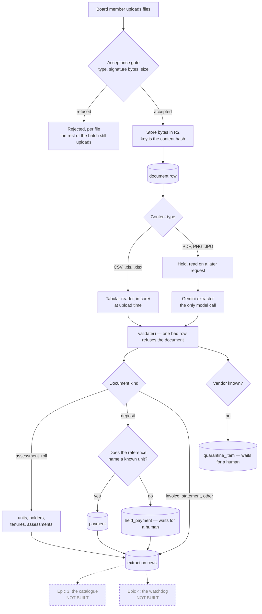

# Fiduciary Watchdog

An AI condominium treasury assistant. A board uploads the association's invoices, bank statements
and assessment rolls; the system reads them into structured records, refuses to guess when a
document is ambiguous, answers questions with the underlying records on screen, and flags probable
duplicate invoices, unusual vendor billing and missed dues before the board pays.

Planning artifacts live in [`_bmad-output/planning-artifacts/`](_bmad-output/planning-artifacts/);
the product requirements are in [`docs/prd/prd.md`](docs/prd/prd.md).

## Prerequisites

- **Node.js 24 or newer.**
- **A PostgreSQL 18 database.** Two connection strings are needed, one writing and one read-only —
  see [Environment](#environment).
- **An S3-compatible bucket** (Cloudflare R2 in the pilot) for the uploaded bytes.
- **A Google Gemini API key**, used only to read scans and photographs. Spreadsheets never reach it.

## Getting started

Five steps, and none of them can be skipped. A clone that stops after `npm run dev` has an
application whose every upload fails on a missing table.

```bash
npm install
cp .env.example .env.local     # then fill it in — see Environment
npm run migrate                # create the schema; without this nothing can be stored
node scripts/add-board-member.mjs board@example.org
npm run dev
```

`add-board-member.mjs` is how a director is created. There is deliberately no sign-up, password
reset, or invitation surface in the pilot — one association, a handful of directors.

Then sign in and go to **Upload**. Start with `samples/assessment-roll.csv`; see
[What to upload first](#what-to-upload-first).

## Environment

Copy [`.env.example`](.env.example) to `.env.local`. It names **fifteen** variables in seven groups:

| Group | Variables | Why |
| --- | --- | --- |
| Database | `WATCHDOG_WRITER_DATABASE_URL`, `WATCHDOG_READER_DATABASE_URL` | Two roles, not one. The reader is `SELECT`-only, and AD-4's separation is real only where a connection string makes it real |
| Sessions | `AUTH_SECRET` | Signs the session cookie |
| Object storage | `R2_ACCOUNT_ID`, `R2_ACCESS_KEY_ID`, `R2_SECRET_ACCESS_KEY`, `R2_BUCKET`, and optionally `R2_OUT_OF_SCOPE_BUCKET` | Document bytes live here; the database holds identity only (AD-16) |
| Extraction | `GEMINI_API_KEY`, `GEMINI_OCR_MODEL` | Reading scans and photographs |
| Agent service | `AGENT_SERVICE_TOKEN` | The bearer token `/tools/v1/*` accepts (AD-15). Unset means the endpoint refuses everyone — and until the private network exists, this token is the only thing in front of it |
| Chat turn | `GATEWAY_SERVICE_TOKEN`, `AGENT_BASE_URL` | How the gateway reaches the agent service (AD-17). A **different** token from `AGENT_SERVICE_TOKEN`, which is the agent's identity in the other direction — one token used both ways means either runtime's compromise grants the other's identity |
| Reasoning model | `REASONING_API_KEY`, `REASONING_MODEL` | The agent service's own model credential (AD-11). Since AD-10's vendor clause was withdrawn on 2026-08-10, extraction and reasoning are one vendor and this separate name is the whole of the boundary — never set `GEMINI_API_KEY` in the agent's environment, or CrewAI hands the reasoning model the extraction key and everything keeps working. `REASONING_MODEL` is optional |

The application **builds and tests without them** — `npm run build` must never require credentials,
or the build gate stops being runnable by anyone who lacks a populated environment. What it cannot
do without them is sign anyone in, store a file, or read a scan.

`npm run test:db` is the exception: it needs both database URLs, and **skips silently without
them**. A skipped suite reports green, so check the skip count rather than the colour.

## What you can upload

The full contract — every format, limit, column and refusal reason, each naming the constant that
enforces it — is in **[docs/upload-contract.md](docs/upload-contract.md)**. A test fails if that
page and the code ever disagree.

The short version: **CSV and Excel are read immediately**, at upload time, and never reach a model.
**PDF, PNG and JPG** are stored and read a few seconds later by Gemini.

### Sample files

Seven files covering the six accepted formats, in [`samples/`](samples/). Two of them are CSVs —
an assessment roll and a deposit feed are different documents in the same format:

| File | Format | What it is | What happens |
| --- | --- | --- | --- |
| `assessment-roll.csv` | CSV | Four units, their holders, and what each owes for 2026 | Creates the units, holders, tenures and assessments |
| `deposits.csv` | CSV | Four payments against units | Three become payments; the fourth names a unit the roll does not have and is **held** |
| `invoices.xlsx` | Excel | Three vendor invoices | Stored as figures; unfamiliar vendors are held for a human |
| `statement.xls` | Excel | A bank statement with **no `type` column** | Stored as statements — `statement` is the default kind |
| `deposit-slip.pdf` | PDF | The same deposit table, as a document | Stored, then read by the model |
| `deposit-slip.png`, `deposit-slip.jpg` | PNG, JPG | An image of that slip | Stored, then read by the model |

Five of these are **generated** from one source of truth by
[`scripts/build-samples.mjs`](scripts/build-samples.mjs), which holds the rows once. Edit the script
and re-run it; editing a generated sample by hand fails the gate.

The **PNG and JPG are not generated** — they are committed images that the script only verifies.
Editing one is fine; re-running the script will not overwrite it.

### What to upload first

**Upload `assessment-roll.csv` before anything else.** Uploading an assessment roll is the only way
units come to exist — there is no units screen.

Upload the deposits first instead and every line is held with `unknown-unit`. That is the system
working correctly: it will not invent a unit to make a payment fit. On a fresh install it looks like
a failure, which is why the order is worth following.

## How a document travels

The fork is the thing to understand: **a spreadsheet is read here, a scan is read by a model.**
Everything else follows from it — cost, latency, and what can go wrong.



**Dashed boxes are not built.** The catalogue and the watchdog are epics 3 and 4; the planning
artifacts describe them in the present tense, and they do not exist.

A longer walkthrough — what each step refuses, and why the split exists at all — is in
[docs/as-built.md](docs/as-built.md).

## The gate

Five commands. **None of them run automatically.**

```bash
npm run lint                   # ESLint 9, flat config
npm run build                  # Next.js production build
npm test                       # Vitest — the unit suite
npm run test:db                # Vitest — the suites that need a database
npx --no-install tsc --noEmit  # type-check; compare against a baseline of 8 pre-existing errors
```

**There is no CI.** The GitLab pipeline was removed on 2026-08-07 — the account bills per minute —
and AD-2's amendment records that withdrawal. `.github/workflows/ci.yml` is a GitHub Actions file
and this repository's remote is GitLab, so it has never run against it.

That makes the list above the only gate there is. An unrun check is simply an unmade claim: neither
ESLint nor Vitest type-checks, and `npm run build` does not compile test files, which is why `tsc`
is on the list separately.

## Layout

```text
app/          Next.js routes, server actions and UI
core/         Pure domain logic — depends on nothing outward, performs no I/O
adapters/     The outside world: auth, db, extraction, storage
catalog/      The versioned query catalog — reviewed SQL and typed parameters, no I/O
agent/        The Python reasoning service — holds the model key, never a data credential (AD-3)
migrations/   21 SQL migrations, applied in order by `npm run migrate`
scripts/      Operational entry points (migrate, add-board-member, build-samples, smoke, verify-*)
samples/      One example upload per accepted format
docs/         The upload contract and the as-built system description
```

`core/` importing anything outward is a test failure, not a convention —
[`core/ports/boundary.test.ts`](core/ports/boundary.test.ts) enforces it.

## NFR-2: no external write credentials

This project holds **no credential for any external financial rail** — no banking platform, no
payment processor, no external accounting or property-management system. That is not a policy
someone remembers to follow; it is a property the build checks.

[`core/security/nfr2-guard.test.ts`](core/security/nfr2-guard.test.ts) runs as part of `npm test`
and fails if anything matching a forbidden credential shape is present. The shapes it looks for, and
the reason each one is forbidden, are in
[`core/security/forbidden-credentials.ts`](core/security/forbidden-credentials.ts).

It reads four surfaces:

1. the environment of the process running it;
2. every `.env*` file on disk, **including git-ignored ones** — `.env` is git-ignored by design and
   is still loaded into the environment by `next build` and `next dev`, which makes it the most
   likely way a credential ever reaches a deploy unit;
3. tracked CI and example config, parsed both for assignments and for `${{ secrets.NAME }}`
   references, so renaming the variable a secret is mapped onto does not hide which secret is being
   reached for;
4. JSON config such as `vercel.json`, whose quoted keys no line-oriented parser can see.

Two things follow, and both are deliberate:

- **If the guard fails, remove the credential.** Do not add an exemption, and do not delete the
  test. Its removal is an architecture change requiring a new decision record, not a cleanup. The
  air-gap this product's safety claim rests on *is* the absence of these credentials — see AD-2 in
  the architecture spine.
- **The guard's limit is stated, not papered over.** It cannot see a secret that exists only in a
  hosting dashboard or in GitHub's secret store and is never referenced by tracked config nor mapped
  into this process's environment. GitHub Actions does not place repository secrets in a step's
  environment unless a workflow maps them, so surface 3 above — not the environment scan — is what
  gives the check reach over CI secrets: a secret no tracked workflow references cannot be used by
  one. Neither deploy unit's *runtime* environment is inspected.

The system does write to its own database — uploaded documents, extracted records, alerts and the
provenance log. NFR-2 constrains outbound writes to third-party systems of record, nothing else.
