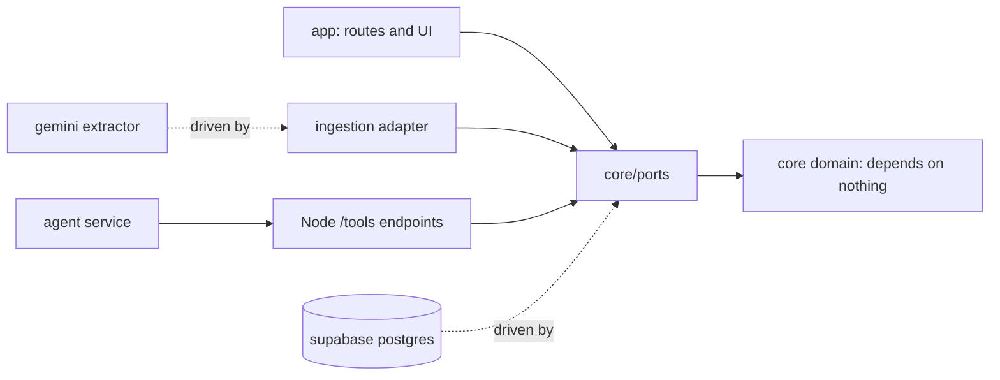
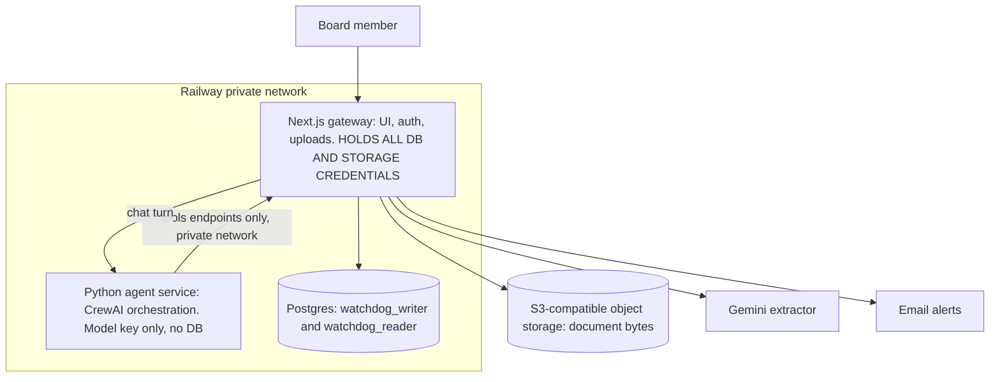
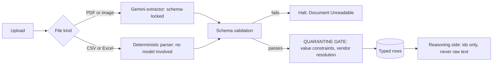
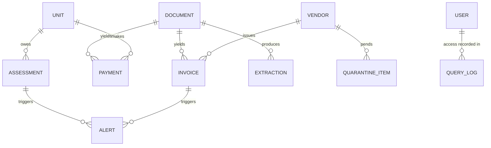

# Architecture Spine — AI Condo Treasury Bot ("Fiduciary Watchdog")

## Design Paradigm

**Hexagonal (ports & adapters), with two structural additions that carry the product's whole safety claim:**

1. **A unidirectional quarantine gate.** Untrusted document content crosses exactly one gate, in one direction, and is laundered into typed values on the way through. Nothing downstream of the gate ever sees raw bytes, raw OCR text, or unbounded strings.
2. **Capability-restricted egress.** The reasoning agent reaches the world only through a fixed, enumerable set of capabilities. It cannot compose new ones at runtime.

Layer → namespace mapping:

| Layer | Lives in | May depend on |
| --- | --- | --- |
| Domain core (pure) | `core/` | nothing |
| Ports (interfaces) | `core/ports/` | domain core |
| Driving adapters (HTTP, UI) | `app/` | ports |
| Driven adapters (DB, extractor, mail) | `adapters/` | ports |
| Agent service (orchestration only) | `agent/` (separate deploy unit) | Node tool endpoints over HTTP |

## Invariants & Rules

### AD-1 — Uploads are the only data plane

- **Binds:** FR-1, FR-7, NFR-1, NFR-2, all ingestion
- **Prevents:** One unit assuming a live accounting/bank integration exists while another builds against uploads; disagreement over which store is authoritative.
- **Rule:** All ledger-like data — deposits, assessment roll, invoices — enters the system exclusively through user upload. No component may open a connection to an external accounting system, bank, or property-management API. The Watchdog's own store is the sole source of truth for everything the system reasons about.

### AD-2 — The air-gap is an absence, not a permission

- **Binds:** NFR-2, all environments, all deploy units
- **Prevents:** A future story "just adding" a write integration, or an operator widening a scope, without an explicit architecture change. Equally: a builder reading "air-gap" as "the system performs no writes" and architecting around a constraint that does not exist.
- **Rule:** No credential granting write access to any *external* financial rail — bank, payment processor, QuickBooks, AppFolio — may exist in any environment, secret store, or CI configuration of any deploy unit. There is no rail to write to; introducing one is an architecture change requiring a new AD, not a configuration change. **The system does own and write its own store** — uploaded documents, extracted records, alerts, and the provenance log — and must, to function. The air-gap constrains outbound writes to third-party systems of record, nothing else. Internal write capability is partitioned by AD-4, not withheld.

- **Amended 2026-08-07 — the CI assertion is withdrawn.** The rule above is unchanged: no external
  financial-rail credential may exist in any environment or deploy unit. What changed is its
  *enforcement*. GitLab CI on this account bills per minute against a budget the project will not
  fund, so the pipeline was removed entirely rather than reduced. `core/security/nfr2-guard.test.ts`
  still runs, in the local gate before every push, and is still the assertion — but it is now
  asserted by convention plus habit rather than by something that runs whether anyone remembers or
  not.

  **State the weakening plainly rather than let it read as equivalent.** A local run is not a gate: a
  branch can be merged with the check never having run, and nothing in the system would say so. The
  same now applies to AD-4's SELECT-only proof and AD-9's extraction probe, which were opt-in CI jobs
  gated on protected credentials and now run only where someone runs them.

  This is a cost decision taken knowingly, recorded here so that a later reader finds a decision
  rather than an erosion. If CI budget becomes available, the single cheapest thing to restore is
  this check alone.

  **Restoring it.** The intent is to bring CI back after the heavy development cycle, so the path is
  written down rather than left to archaeology.

  The last good config is 96 lines and lives at **`621d4cc:.gitlab-ci.yml`** — recover it verbatim
  with `git show 621d4cc:.gitlab-ci.yml > .gitlab-ci.yml`. It already carries the three fixes that
  cost the most to learn: one pipeline per commit rather than two, the full suite on merge requests
  as well as `main`, and no path-based skipping. Do not re-derive it.

  Reverse alongside it: this amendment, the two Consistency Convention rows above, and the ten places
  in `bmad-ship-story` that stopped expecting a pipeline (Step 7 in particular, which became
  "verify the head, locally").

  **Consider a cheaper shape than the one withdrawn.** The pipeline was removed because GitLab.com
  bills per minute on *shared* runners. Three options change that arithmetic, in rough order of how
  much they give back per unit of effort:

  1. **A self-managed runner.** Compute minutes apply only to GitLab-hosted runners. A runner
     registered on any machine you already own consumes none, which restores the full pipeline at
     zero marginal cost. This is the option that makes the cost question go away rather than
     rebalancing it.
  2. **`main` only.** Drop merge-request pipelines and verify after merge. Cheap, and honest about
     what it is: post-merge detection, not a gate — the mistake this project already made once and
     reverted, so it should be chosen deliberately if at all.
  3. **Manual pipelines.** A configured pipeline that runs only when somebody triggers it. Costs
     nothing until used and is useful before a release, but a gate nobody is obliged to run is the
     same category of thing as the local gate that replaced it.

  Option 1 is the only one that restores the property that was actually lost: a check that runs
  whether or not anyone remembers.

### AD-3 — The LLM-adjacent runtime holds no data credentials

- **Binds:** NFR-1, NFR-2, FR-4, the agent service
- **Prevents:** A prompt-injected or misbehaving agent reaching data directly; credential sprawl across two runtimes.
- **Rule:** The Node gateway holds every database credential and the object-storage key. The Python agent service holds exactly two secrets — the model API key and AD-15's gateway service token — and never a database credential, connection string, or storage key. It obtains every fact by calling Node's tool endpoints. A code path that gives the agent service data access is a violation, not an optimization.
- **Realization (2026-07-31):** both runtimes and Postgres sit on one Railway private network. The database is not reachable from the public internet at all, so this rule is enforced by network topology as well as by credential distribution — a misconfigured agent service cannot reach the database even if it somehow acquired a connection string.
- **Amendment (2026-08-10):** the *count* was wrong; the invariant was not. AD-15, decided later on 2026-07-31, requires a shared service token so the gateway can tell its own agent from anyone else — so the runtime holds two secrets, the model API key and `AGENT_SERVICE_TOKEN`. Neither is a data credential, and what this AD exists to prevent is untouched. `agent/tests/test_no_data_credentials.py` asserts the read set *exhaustively*, so a third variable fails the suite and stays a decision somebody makes rather than a line that slips through.

### AD-4 — Roles separate by pipeline stage, not by service

- **Binds:** NFR-1, ingestion, Oracle query path
- **Prevents:** The LLM-driven read path acquiring the ability to mutate; a single omnipotent role used everywhere.
- **Rule:** Two database roles. `watchdog_writer` may INSERT/UPDATE and is used *only* by the ingestion pipeline. `watchdog_reader` is SELECT-only and is the *only* role any catalog query executes under. Neither role may be granted the other's capability. This is the pilot's realization of NFR-1's intent — read-only enforcement scoped to the LLM-driven path.
- **Realization (2026-07-31):** on a plain Postgres these are ordinary `CREATE ROLE` statements in a migration, with grants written explicitly and reviewable in the diff. The separation is proven by a test that connects as `watchdog_reader` and asserts an INSERT fails. A migration that grants the reader anything beyond SELECT is a violation the test must catch, not a judgement call at review time.

### AD-5 — The reasoning model never authors SQL

- **Binds:** FR-4, FR-5, NFR-5
- **Prevents:** Unreviewed query text reaching member financial data; prompt-injected query generation; unbounded scans.
- **Rule:** The agent selects a named entry from a fixed, version-controlled query catalog and supplies typed parameters. Tool definitions are declared with `strict: true` and `additionalProperties: false`, so parameter validation is guaranteed at the API layer rather than requested by prompt. Free-form SQL from a model is never executed. A new question shape is a new catalog entry — a story, not a runtime capability.

### AD-6 — Catalog entries return every number the answer needs

- **Binds:** FR-5, FR-6, FR-7, SM-1
- **Prevents:** An answer that requires arithmetic the model is structurally forbidden from performing, producing a validator rejection loop.
- **Rule:** A catalog entry must return all values its answers reference, **including derived ones** — deltas, percentages, trailing averages, counts, aging buckets. FR-6's "exceeds the trailing 6-month average by 20%" is a query returning the computed percentage, not a raw average for the model to divide.

### AD-7 — Numbers are provenance-bound, not prompt-restricted

- **Binds:** NFR-3, FR-5, SM-1
- **Prevents:** A hallucinated or silently rounded figure reaching a board member; an unenforceable 100% success metric.
- **Rule:** Every numeric token in a rendered answer must match a value present in the tool result set for that turn. A pre-render validator rejects any unreferenced numeral and forces a retry. The validator carries an explicit normalization rule for formatting (`1240` ≡ `$1,240.00`) and rejects rounding that is not itself a returned value. This supersedes NFR-3's system-prompt mechanism; prompt directives may remain as defence in depth but carry no enforcement weight.

### AD-8 — Extracted values are data, never instructions

- **Binds:** FR-2, FR-3, FR-6, FR-8
- **Prevents:** A schema-valid injection payload in a field value (e.g. `vendor_name`) steering the anomaly agent or reaching a board member's inbox.
- **Rule:** Every extracted field carries value-level constraints beyond its type — length caps, format regex, enums. Vendor identities resolve against a known-vendor table; unknowns route to a human-confirm quarantine queue and never auto-create. Extracted strings are **never string-interpolated into any prompt**: prompts carry row identifiers, tools resolve values, and the renderer escapes on output.

### AD-9 — Schema conformance is enforced at the extractor's API layer

- **Binds:** FR-3, FR-2
- **Prevents:** Malformed data reaching the reasoning side because a downstream validation step was skipped or misimplemented.
- **Rule:** The extractor is invoked with a machine-enforced output schema (`responseMimeType: application/json` plus `responseSchema`). Output that fails schema validation halts the pipeline and returns a structured "Document Unreadable" error. No partial or best-effort extraction is passed downstream.

### AD-10 — The dual-LLM boundary is a credential and deploy-unit boundary

- **Binds:** FR-2, NFR-2, the compliance narrative
- **Prevents:** Extraction and reasoning drifting into one context, one key, or one control plane as a convenience.
- **Rule:** The extractor and the reasoning agent hold **different API keys** and run in **different deploy units**. Neither may be reconfigured to use the other's credential. Raw document bytes and raw extracted text never enter the reasoning agent's context window under any code path.
- **Amendment (2026-08-10):** the *vendor* clause is withdrawn. Reasoning moves from `claude-sonnet-5` to `gemini-3.6-flash`, so both sides are Google and the boundary cannot be a vendor boundary any more. **What that costs:** a client pointed at the wrong provider is no longer stopped by the host it resolves to, so `shared-credential` in `core/security/dual-llm-boundary.ts` becomes the load-bearing clause — it was previously redundant with the vendor check and is now the only thing between the two sides at the credential layer. **What it does not cost:** separate keys (`GEMINI_API_KEY` for extraction, `REASONING_API_KEY` for reasoning), separate deploy units, and the data-path isolation FR-2 actually rests on — the reasoning runtime holds no storage key and no database credential (AD-3), so it cannot fetch raw bytes even if a prompt asked it to. **Residual gap:** nothing automated inspects the *deployed* agent unit's environment. `deploy-units.json` is a declaration, and AD-3's exhaustive guard reads source and committed config, not the hosting account.

### AD-11 — The reasoning model is bound by capability, not by name

- **Binds:** NFR-4, FR-4, AD-5
- **Prevents:** The spine going stale on model turnover; a model without schema guarantees being substituted in.
- **Rule:** The reasoning model **must** support strict tool use and schema-validated structured outputs. A model lacking either is disqualified regardless of benchmark standing, because AD-5's enforcement depends on both. The specific model id is seed, not invariant. This replaces NFR-4's named-model pin and its competitor callout.

### AD-12 — Every query execution is logged before it returns

- **Binds:** NFR-5, FR-5
- **Prevents:** A gap in the audit trail; a retrofit that logs only some paths.
- **Rule:** Each catalog execution appends an immutable record — user id, timestamp, catalog entry id and version, bound parameter values, and the exact SQL text executed — *before* the result is returned to the caller. The log is append-only; no application role may UPDATE or DELETE it. A query path that can execute without writing this record is a defect.

### AD-13 — Ingestion is idempotent on document identity

- **Binds:** FR-1, FR-6, FR-7, all ingestion, ALERT
- **Prevents:** Two independently-built ingestion paths (first upload, re-process, retry-after-failure) each obeying every other AD yet writing duplicate invoice, payment, and alert rows for the same document. In a product whose headline feature is *duplicate-invoice detection*, a pipeline that manufactures duplicates is a self-inflicted false positive.
- **Rule:** Every uploaded document carries a content hash computed before extraction. Re-ingesting a document with an existing hash **replaces** that document's derived rows rather than appending, and never emits a second alert for a finding already raised. Alerts are keyed on `(finding_type, subject_id, period)` so re-processing is a no-op. Exactly one component owns creation of each derived entity; a second write path for the same entity is a violation.

### AD-14 — Catalog entry versions are immutable

- **Binds:** NFR-5, FR-5, AD-5, AD-12
- **Prevents:** The audit trail silently lying. AD-12 records the catalog entry id and version; if a version's SQL can be edited in place, a log line reading `dues_status@2` no longer identifies the SQL that actually ran — and a fiduciary audit trail that cannot be replayed is worse than none.
- **Rule:** Once a catalog entry version is used in production, its SQL text and parameter schema are frozen. Changing either mints a new version. The provenance log's `(entry_id, version)` pair must always resolve to exactly one SQL text, forever. Vendor identity has a single owner for the same reason: only the quarantine-confirmation path may create a vendor row.

### AD-15 — Two runtimes, one wire contract

- **Binds:** all cross-service calls
- **Prevents:** Ad-hoc endpoints accumulating between the gateway and the agent service; an unauthenticated data path.
- **Rule:** The Python agent service reaches Node only through versioned `/tools/*` endpoints, which are the sole data path in the system and must reject any caller that is not the agent service. The Python service pins **Python 3.13** — CrewAI's `requires_python` is `<3.14,>=3.10`, so the ambient 3.14 interpreter cannot host it.
- **Mechanism (decided 2026-07-31, previously deferred):** the `/tools/*` endpoints are bound to the Railway private network and are not published on any public domain. Caller identity is asserted by a shared service token held only by the agent service and the gateway. This was deferred pending a concrete deployment topology; co-locating both runtimes on one private network makes private networking the answer, and network reachability now carries most of the weight the token would otherwise carry alone.

### AD-16 — Document bytes live in object storage; the database holds their identity

- **Binds:** FR-1, FR-2, AD-8, AD-13, all ingestion
- **Prevents:** Document bytes leaking into query results and from there toward the reasoning side; a database whose backup size is dominated by PDFs; two components disagreeing about where a document actually is.
- **Rule:** An uploaded document's bytes are written to object storage and nowhere else. The database stores its **identity and metadata only** — content hash, storage key, filename, size, media type, upload time, and the typed rows extraction produced. No table holds document bytes, and no catalog entry may return a storage key to the agent. Exactly one adapter (`adapters/storage`) may construct a storage client; the port it implements is deliberately narrow — put, get, delete by key — so the provider is swappable and no caller can reach for provider-specific behaviour.
- **Why it is stated now:** Supabase bundled storage and database behind one vendor, which made the boundary implicit. Splitting them (Railway Postgres + S3-compatible object storage) makes it a decision someone could get wrong, so it becomes a rule.

Dependency direction — an arrow means "may depend on"; the absence of a reverse arrow is the rule:



## Consistency Conventions

| Concern | Convention |
| --- | --- |
| Naming | Catalog entries are `verb_noun` (`dues_status`, `vendor_trailing_avg`) and versioned (`dues_status@2`); DB tables snake_case plural; TS types PascalCase. |
| Money | **Amended 2026-08-07.** Exact decimal end to end: `numeric(p,s)` in Postgres, a **decimal string** across every boundary. Never a float, never a JS `number` for an amount. Formatting happens only at render. *This row previously said "integer minor units (cents) end to end", and epic 1 shipped the other way: `extraction.total_amount` is `numeric(14,2)` and `core/extraction/record.ts` documents `totalAmount` as a decimal string, with a migration-text test pinning `numeric(p,s)`. Story 2.2 had to choose, because story 2.4 compares an extracted payment against a stored assessment and two representations would put a rounding conversion inside the comparison that produces arrears findings. The shipped convention won; the words were wrong, not the code.* |
| Dates | ISO-8601 date (`2026-07-29`) for accounting periods; UTC `timestamptz` for events. Assessment periods are dates, not timestamps. |
| Ids | Database rows use uuid v7. Catalog entries use stable string ids. Vendors are referenced by id, never by extracted name. |
| Errors | One envelope `{code, message, detail?}`. Extraction failures use the FR-1 user-facing copy verbatim. Never surface a raw provider error to a board member. |
| Tool contracts | Every agent-facing tool declares `strict: true` and `additionalProperties: false`. A tool without both is not registered. |
| Logging | Structured JSON. Query provenance (AD-12) is a separate append-only table, not application logs. Never log extracted field values at info level. |
| Config | Secrets by environment variable only, never committed. The *absence* of write credentials (AD-2) is asserted by `core/security/nfr2-guard.test.ts`, which runs in the local gate before every push. **It is no longer a CI check** — see AD-2's amendment of 2026-08-07. |
| Tests | Vitest for the Node/Next side, pytest for the Python service (3.13). **Neither runs in CI** — there is no CI; see AD-2's amendment of 2026-08-07. Both run in the local gate before every push. Test-first per `bmad-dev-tdd`. |

## Stack

Verified current 2026-07-29. The code owns these once it exists.

| Name | Version | Note |
| --- | --- | --- |
| Next.js | 16.2.x | 16.2.12 in the code |
| TypeScript | 5.x | 5.9.3 pinned; TS 7 is a spine amendment, not a scaffold choice |
| **Postgres (Railway)** | 18.4 | Replaced Supabase 2026-07-31; uuidv7() is native, no extension needed |
| **Auth.js (NextAuth)** | v5 (`5.0.0-beta.32`) | Credentials provider, **JWT sessions** — see the correction below |
| **Object storage** | S3-compatible (Cloudflare R2) | Behind `adapters/storage`, per AD-16 |
| Python (agent service) | 3.13 | CrewAI `requires_python` is `<3.14,>=3.10` |
| CrewAI | 1.15.8 | |
| Reasoning model | `gemini-3.6-flash` | Bound by capability, not name (AD-11). Own key, separate from extraction's (AD-10, amended 2026-08-10) |
| Extraction model | `gemini-3.1-flash-lite` | |
| Vitest | 4.x | |
| pytest | current | |

**Hosting.** The Next.js gateway, the Python agent service, and Postgres all run on **Railway**, on
one private network. Object storage is the single external dependency in the data plane.

**Correction — sessions are JWT, not database rows (2026-07-31).** The decision was recorded as
"sessions in Postgres". That is **not achievable with the Credentials provider**: Auth.js supports
database sessions only with providers that perform their own redirect flow, and the two are mutually
exclusive by design. The consequence is real and is stated rather than discovered later — **a session
cannot be revoked server-side before it expires.** Disabling a departed director stops them signing
in again but does not immediately kill a session they already hold. `maxAge` is set to 8 hours to
bound that window. Genuine revocation would mean moving to an email magic-link provider, which needs
a mail sender this project does not build until Epic 4 — so it is a deliberate pilot-scope
acceptance, revisited when `adapters/mail` exists.

**Auth.js v5 is pinned at a beta.** `5.0.0-beta.32`; the stable line is v4, which predates the App
Router. "Use the stable one" is the more dangerous choice here, not the safer one. Recorded so the
pin reads as a decision rather than an accident.

**Why Supabase left (2026-07-31).** Access to Supabase was blocked for this project. It had been
carrying three jobs — Postgres, auth, and object storage — and only the first has a drop-in
replacement, so the swap forced two real decisions rather than a connection-string change. The
replacements were chosen for boringness: Auth.js is the conventional Postgres-backed auth for this
stack, and S3-compatible storage is the conventional answer for documents. Both sit behind adapters,
which is what kept the change cheap: `core/` never knew Supabase existed.

## Structural Seed

Container view — only one component holds database credentials:



Postgres is not published to the public internet; only the gateway is. The agent service reaches
nothing but the gateway, and reaches it privately.

Ingestion path — the quarantine gate is the only crossing, and it is one-way:



Core entities:



Source tree:

```text
HOA-Treasurer-Assistant/
  app/            # Next.js routes, UI, auth
  core/           # pure domain - no I/O, no imports outward
    ports/        # interfaces the adapters implement
  adapters/
    auth/         # Auth.js configuration and session access
    db/           # both roles live here; nothing else opens a connection
    storage/      # the only place a storage client is constructed (AD-16)
    extraction/   # Gemini adapter + schema definitions
    mail/         # alert delivery
  migrations/     # SQL, including the two role definitions and their grants
  catalog/        # versioned query catalog - reviewed SQL + typed params
  tools/          # /tools/* endpoints, the agent service's only data path
  agent/          # Python service (3.13, CrewAI) - separate deploy unit
  docs/prd/       # PRD
  _bmad-output/   # planning + implementation artifacts
```

## Capability → Architecture Map

| Capability / Area | Lives in | Governed by |
| --- | --- | --- |
| FR-1 Document upload | `app/`, `adapters/db`, `adapters/storage` | AD-1, AD-9, AD-16 |
| Board member sign-in | `app/`, `adapters/auth` | AD-4 |
| FR-2 Extraction isolation | `adapters/extraction` | AD-8, AD-9, AD-10 |
| FR-3 Schema conformance | `adapters/extraction` | AD-9 |
| FR-4 Intent routing & tool execution | `agent/`, `tools/` | AD-3, AD-5, AD-11 |
| FR-5 Show-your-work transparency | `app/`, `catalog/` | AD-5, AD-6, AD-7, AD-12 |
| FR-6 Vendor / invoice anomalies | `catalog/`, `core/` | AD-6, AD-8 |
| FR-7 Dues triangulation | `catalog/`, `core/` | AD-1, AD-6 |
| FR-8 Multi-channel alerting | `adapters/mail`, `app/` | AD-8 |
| NFR-1 Read-only enforcement | `adapters/db` | AD-3, AD-4 |
| NFR-2 No external write tokens | all environments | AD-2 |
| NFR-3 Zero-LLM-token arithmetic | `app/` render path | AD-7 |
| NFR-4 Model restrictions | `agent/` | AD-11 |
| NFR-5 Query provenance | `tools/`, `adapters/db` | AD-12 |

## Deferred

- **Cloud storage ingestion (Dropbox / Google Drive).** Requested 2026-07-30; scheduled as an epic
  *after* the core pilot, with direct upload remaining the primary path. **AD-1 must be amended
  before that epic starts** — its rule that data enters "exclusively through user upload" becomes
  false, though its intent (no connection to a bank or accounting system of record) survives intact,
  since cloud storage is a document source and not a financial rail. AD-2 is unaffected.
  AD-13's content-hash idempotency already covers the repeated-presentation behaviour a synced
  folder produces. Two consequences to carry: the board explainer's claim that the system "sees the
  documents the board chooses to upload and nothing else" stops being true and needs redrafting;
  and **a connector that silently stops working is worse than no connector**, so connection health
  and a stopped-watching alert are requirements, not enhancements. Provider burden is asymmetric —
  Dropbox app-folder scope is light, while Google `drive.readonly` is a restricted scope requiring
  an annually-revalidated third-party CASA assessment. To be built as a provider-agnostic port with
  two adapters.
- ~~**Service-to-service auth mechanism** for the `/tools/*` boundary.~~ **Resolved 2026-07-31** — see AD-15. Co-locating both runtimes on a Railway private network made private networking plus a shared service token the answer.
- **Backup and restore for object storage.** Splitting documents out of the database means the database backup no longer contains them. Two stores now need a recovery story, and they must be recoverable to a consistent point — a restored database referencing storage keys that no longer exist is worse than either failure alone. Interacts with the retention question below.
- **Model tiering.** A cheaper model for FR-8 alert prose, where deterministic SQL does the work. Revisit if pilot token spend becomes material — at one association's volume it will not.
- **Extraction model tier.** Newer Gemini Flash tiers exist; `gemini-3.1-flash-lite` is bound on measured cost and quality. AD-9's API-layer schema enforcement is the invariant; the model id is not.
- **Multi-tenancy.** The pilot is one association. Row-level security, tenant scoping in the catalog, and per-tenant vendor tables are deliberately out of scope and will require revisiting AD-4 and AD-5 before a second association is onboarded.
- **Retention and deletion.** How long documents, extractions, and the provenance log are kept. Interacts with the fiduciary-record obligations the PRD cites but does not specify.
- **Backup and recovery posture** for the Watchdog store. Part of the operational envelope, not yet decided.

## Upstream Reconciliation

All known divergence from `docs/prd/prd.md` has been resolved at the source (2026-07-30). The PRD now carries:

| PRD entry | Change | Governed by |
| --- | --- | --- |
| Air-Gap (glossary) | Rewritten as an absence of banking credentials, with an explicit statement that the system does write its own store | AD-2 |
| Non-goal "Ledger Mutation" | Renamed **External Ledger Mutation** and scoped to external systems of record | AD-1, AD-2 |
| NFR-1 | Rewritten as role separation by pipeline stage; the old wording described read-only roles against an external database that does not exist | AD-4 |
| NFR-1a (new) | No data credentials in the LLM runtime | AD-3 |
| NFR-2 | Sharpened to absence-of-credential across environments, secret stores, and CI | AD-2 |
| NFR-3 | Rewritten from prompt directives to provenance-bound validation | AD-7 |
| NFR-4 | Rewritten as a capability bar; the previous pin named a model retired in October 2025 | AD-11 |

No open contradictions remain between the PRD and this spine.
